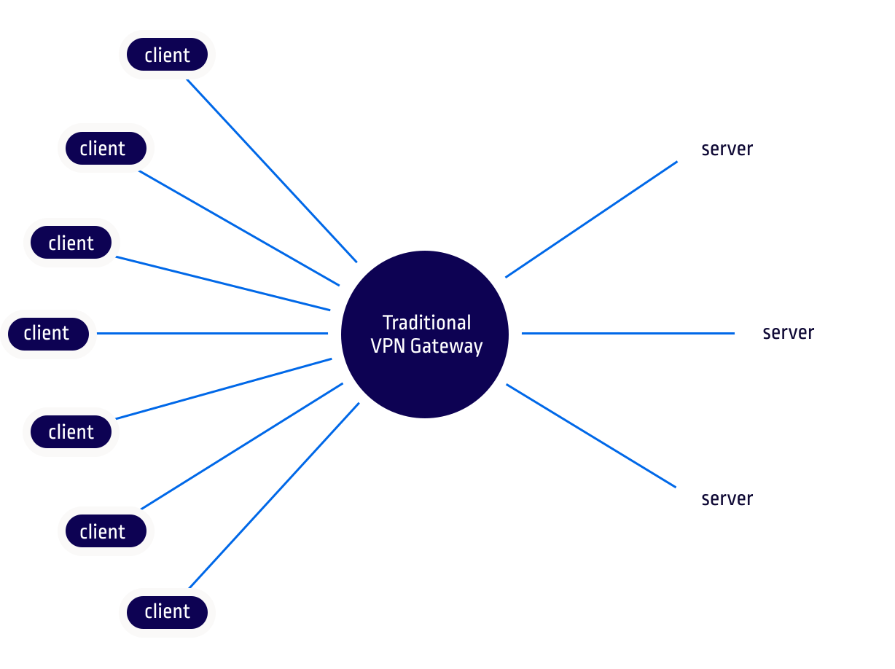
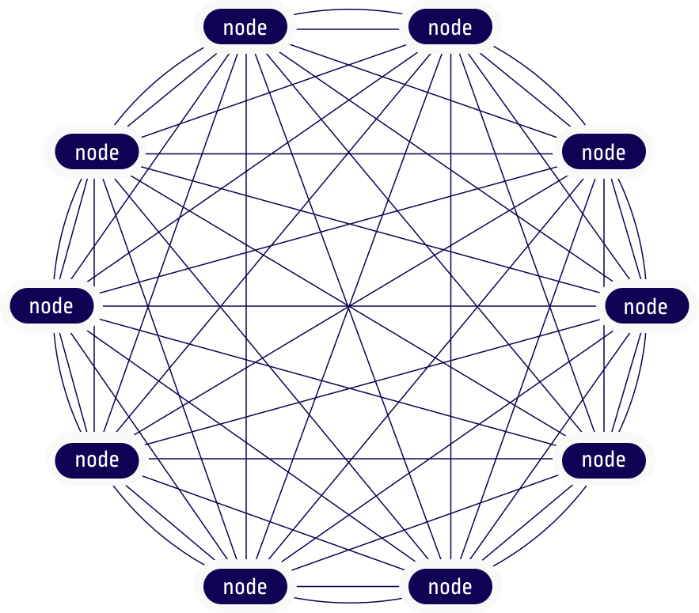

Network bandwidth has been increasing and latency decreasing in the network providers offer everything thanks to the fiber optical cables and better networking infrastructure. Datacenter-like speeds are now available at home!  
Despite this great offering, we can't count on data centers like reliability, if we want it, we have to create it.  
Hosting servers at home usually is not very common because of the added equipment cost needed to have it running 24/7 and additional costs with public IP offerings. Having a decentralized approach can bring more resiliency and does not obligate having expensive infrastructure costs, we can rely on more servers interconnected to each other to create a mesh network of servers running a different variety of services.  
This is possible using the concept of Peer to Peer private network, we can mix between cloud servers and on-premises servers, ... 
But first, let's understand the types of private networks available with their cons and pros.  

### Using a Central VPN Server

A Virtual Private Server with a Public IP address is acting as VPN Server. The Home Network connects to the VPN Server and exposes the networks above. Now when a client connects to the VPN Server it will forward traffic to the routed networks and servers.  

This approach is not the best because it introduces latency due to the server in the middle, it does also introduces a lot more complexity mantaining it.  

As of today, the recommended VPN service is [Wireguard](https://www.wireguard.com) since it is fast and reliable, other VPN services can also work such as [OpenVPN](https://openvpn.net) but I won't recommend it since it's slower and requires even more configurations, it might be an option in restricted networks that won't work with UDP (Which is the only supported protocol that Wireguard uses).  

### Using a P2P (Client to Client)

P2P allows to connect clients to each other, if one of them goes down, only that client is unreacheble. 
This approach is by far the more resilient because there are no single point of failure in terms of connectivity.  
Not always is possible to achieve peer to peer connectivity that's why it's not more commonly used.  

### Let's go!
With this in mind, it's time to implement a mesh network using [Tailscale](https://tailscale.com)!

#### Why Tailscale?  
Tailscale implements the above virtual private networking concepts with almost zero configurations, and the great thing is that it uses Wireguard under the hood!

### Implementation
- Log in on the Tailscale webpage.  
- Install tailscale on every server that wants to be part of your [Tailnet](https://tailscale.com/kb/1136/tailnet).  
- Check connectivity between them and also allow traffic forwarding on those that are exposing also hosts from their network.  

And that's it! The connectivity part is done. I recommend to use the commands `tailscale status` to check your Tailnet and `tailscale netcheck` to report about the current server connectivity options.  

In situations where some of the servers are not able to reach each other by default it will use the [Tailscale Derp servers](https://tailscale.com/kb/1118/custom-derp-servers), however you may want to deploy one by yourself in a server with a public ip available near to the others so it can be used as a intermediary.  
That's right, tailscale implements both virtual private network concepts to ensure that all servers can reach each other.  